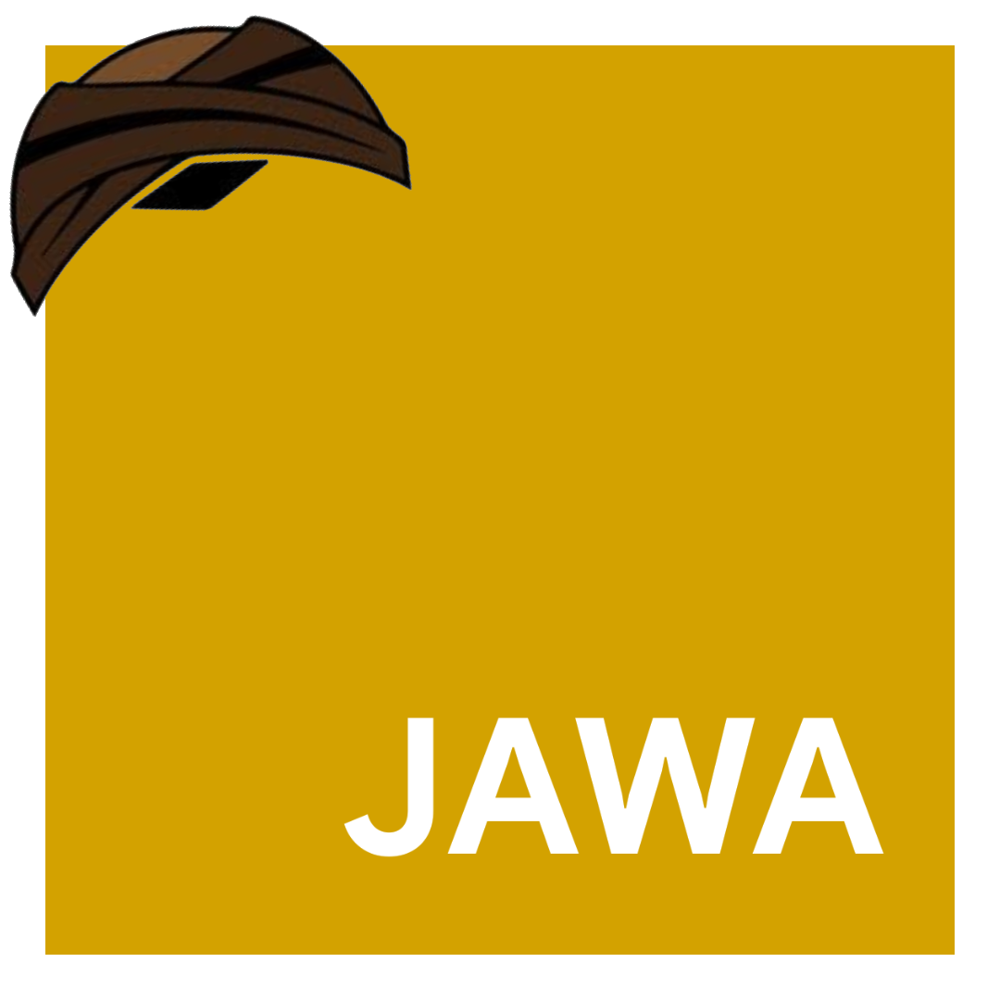

# JawaScript



A script built in Javanese Language, a language that is easy to use and implement and has the same structure as JavaScript because it is only a translation.

> Remember
>
> I'm not focusing on the top priority of this project, but if you want to try developing or updating on my repo please do, if there are any problems please report them, this is also just entertainment material.

## Usage?

Install this repository on your global package module

```
npm i jawascript@https://github.com/ernestoyoofi/jawascript
```

Then try running it with this command, you can also compaling from .jawa to .js

```
jawaskrip example.jawa
```

Use the --dir flag to compaliling the language in your folder which will appear in the output folder with extension.js

```
jawaskrip --dir ~/usr/app 
```
